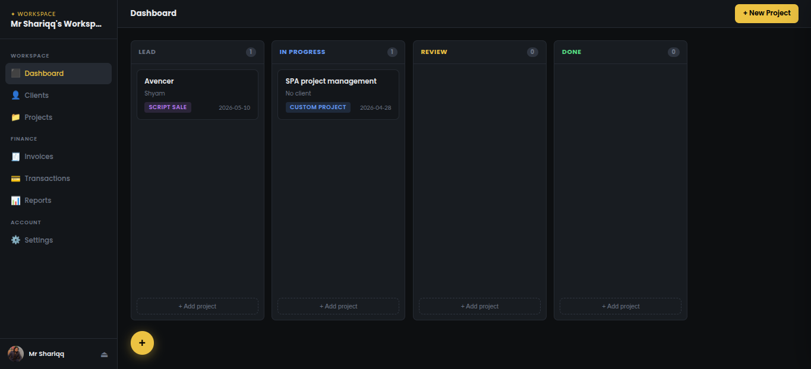
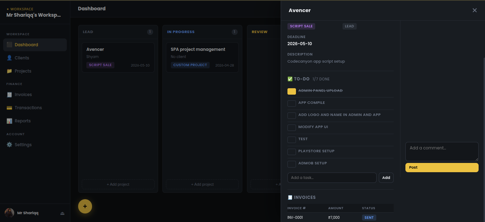
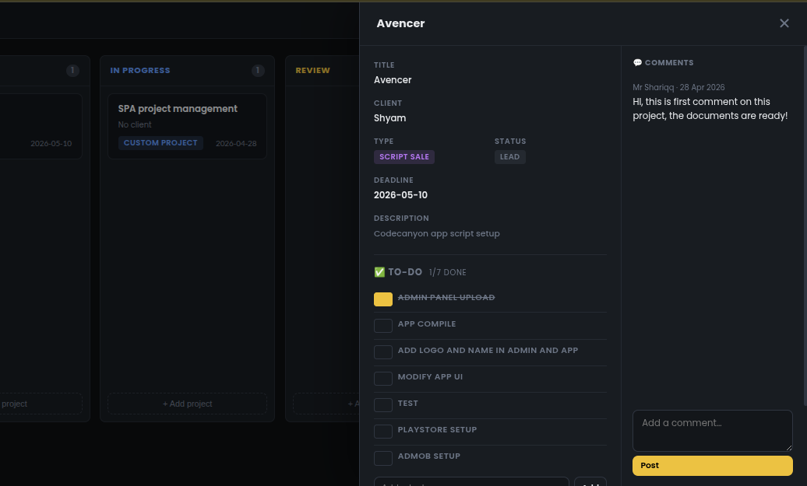
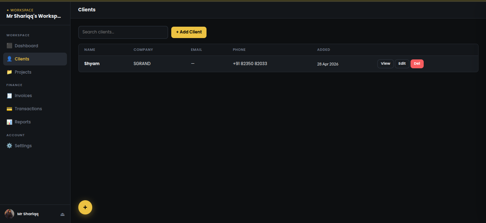
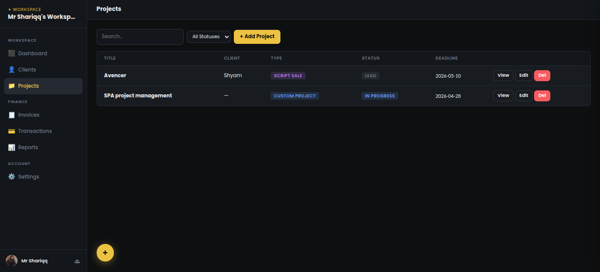
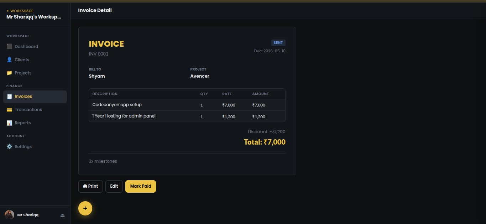
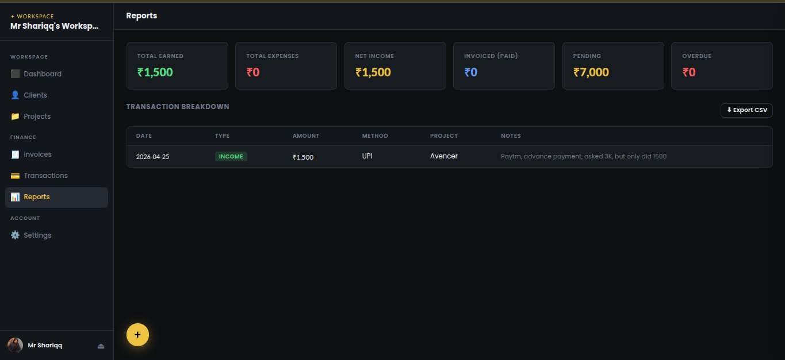
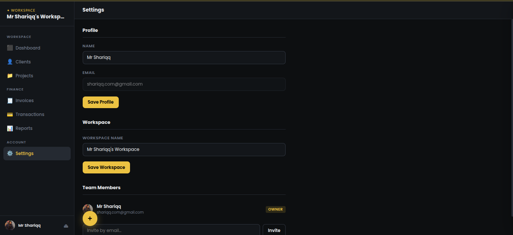

# Fylance
> Freelance management, simplified.

Fylance is an all-in-one workspace for freelancers to manage clients, projects, invoices, and finances — without the chaos. It runs as a single static file powered by Firebase, requiring zero backend setup and zero server maintenance.

---

## Screenshots










---

## Why Fylance?

Most project management tools are either too complex, too expensive, or built for teams — not solo freelancers.

Fylance is a lightweight, serverless SPA that gives you a full CRM and project management suite in a single `index.html`. No backend. No database server. No monthly infrastructure cost. Just connect your Firebase project, deploy anywhere, and you're running.

- ⚡ Serverless — Firebase handles everything
- 🔒 Secure — data locked to your Google account
- 🌍 Runs anywhere — localhost, static host, or any CDN
- 💸 Free to self-host — Firebase free plan is more than enough for solo use

---

## Features

**Clients**
- Full client directory with search and filters
- Client profile showing all linked projects, invoices, transactions, and notes

**Projects**
- Kanban board with drag & drop cards
- Customizable columns and filters
- Project detail view — full info, comments, and to-do list

**Invoices**
- Create and manage professional invoices
- Track status — Draft, Sent, Paid, Overdue
- View, download, and send invoices to clients

**Transactions**
- Log income and expenses
- Link payments to invoices and projects
- Full history with filters

**Reports**
- Earnings summary — total received, pending, and overdue
- Filter by date, client, or project
- Export as CSV

**Teams**
- Invite team members to your workspace
- Role-based access — Owner and Member

---

## Getting Started

### 1. Set up Firebase

1. Go to [Firebase Console](https://console.firebase.google.com) and create a new project
2. Add a **Web App** to the project and copy the config credentials
3. Enable **Firestore Database** in the Firebase console
4. Enable **Google Sign-in** under Authentication → Sign-in methods

### 2. Add Firebase credentials

Open `SPA/firebase.js` and paste your Firebase config:

```js
const firebaseConfig = {
  apiKey: "YOUR_API_KEY",
  authDomain: "YOUR_AUTH_DOMAIN",
  projectId: "YOUR_PROJECT_ID",
  storageBucket: "YOUR_STORAGE_BUCKET",
  messagingSenderId: "YOUR_MESSAGING_SENDER_ID",
  appId: "YOUR_APP_ID"
};
```

### 3. Set Firestore security rules

In Firebase Console → Firestore → Rules, replace the default rules with:

```
rules_version = '2';
service cloud.firestore {
  match /databases/{database}/documents {
    match /workspaces/{workspaceId} {
      allow read, write: if request.auth != null
        && request.auth.uid == workspaceId;
    }
    match /workspaces/{workspaceId}/{document=**} {
      allow read, write: if request.auth != null
        && (request.auth.uid == workspaceId
        || exists(/databases/$(database)/documents/workspaces/$(workspaceId)/members/$(request.auth.uid)));
    }
  }
}
```

### 4. Run the app

**Linux / macOS**
```bash
bash run.sh
```
The script auto-detects Node, PHP, or Python and starts a local server at `http://localhost:8101`.

**Windows**
Serve the `/SPA` folder using any local server (e.g. Live Server in VS Code).

**Static hosting**
Upload the contents of the `/SPA` folder to any static host (shared hosting, Netlify, Vercel, etc.). No server-side configuration needed.

---

## Who is it for?

- Freelance developers and designers
- Independent creators and consultants
- Small studios and agencies
- Anyone who gets paid per project and wants to stay organised

---

## Credits

Built with ❤️ by **Muhammed Shariq Ahmed**

🌐 [cksoftwares.com](https://cksoftwares.com)
✉️ shariqq.com@gmail.com

A product of **CK Softwares**